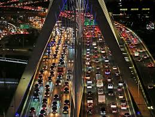

```{r setup, echo=FALSE, results='hide', message=FALSE, warning=FALSE}
knitr::opts_chunk$set(echo=FALSE, message=FALSE, warning=FALSE)
# Uvoz vseh potrebnih knjižnic
source("lib/libraries.r", encoding="UTF-8")
```



***

## Izbira teme

V svoji projektni nalogi bom preučil nekatere ključne stvari cestnega prometa v Sloveniji.

Analiziral bom, katera prevozna sredstva ljudje uporabljajo in kako se to razlikuje skozi daljše časovno obdobje. Poleg tega bom prikazal količinsko razliko uporabljenih cestnih vozil po regijah tudi skozi leta, prav tako pa pogledal porast uporabe osebnih in specialnih avtomobilov na alternativne vire goriva v skrajnih letih. Podobno si bom prizadeval v najdbi povezave med povprečno starostjo osebnih avtomobilov in povprečno mesečno neto plačo po regijah ter preveriti to spremembo med plačo in starostjo osebnega avtomobila v nekem daljšem časovnem intervalu. Za nameček bom pogledal še, kako se spreminja število umrlih v cestnoprometnih nesrečah na 10.000 registriranih motornih vozil po posameznih regijah. Ob pomoči analize podatkov bom izsledil navezo med deležem potnikov in prometnih nesreč, glede na uporabo določenih prevoznih sredstev.

Cilji moje proučitve bodo opažanje sprememb različnih prevoznih sredstev, število umrlih, povprečni delež osebnih avtomobilov in povprečna starost le teh skozi leta. Nekatere spremembe bodo prikazane glede na regije v Sloveniji.

***

## Obdelava, uvoz in čiščenje podatkov

```{r uvoz}
source("uvoz/uvoz.r", encoding="UTF-8")
```

Naslonil sem se na podatke, ki sem jih priskrbel iz spletne strani Statističnega urada Repubblike Slovenije. Podatki predvsem obsegajo obdobje od leta 2004 do leta 2020.
Dane podatke sem najprej shranil v obliki CSV datotek, potem jih preuredil in jih razporedil v več razpredelnicah v obliki *tidy data*.

Tabela 1 (potniski promet: Število potnikov v različnih prevoznih sredstvih):

- `Vrsta_prevoza` - spremenljivka: prevozno sredstvo
- `Leto` - spremenljivka: leto
- `Stevilo_potnikov` - meritev: število potnikov v 1000

Tabela 2 (pogon in goriva: Število osebnih in specialnih avtomobilov glede na vrsto goriva in pogona):

- `Vrsta_pogona` - spremenljivka: Vrsta pogona osebnih avtomobilov   
- `Leto` - spremenljivka: leto
- `Stevilo_avtomobilov` - meritev: število avtomobilov v prometu

Tabela 3 (preminuli: Število umrlih v cestnoprometnih nesrečah na 10.000 regitriranih motornih vozil po regijah):

- `Regija` - spremenljivka: regija
- `Leto` - spremenljivka: leto
- `Preminuli` - meritev: število umrlih na 10.000 registriranih motornih vozil

Tabela 4 (osebni avtomobili: Število osebnih avtomobilov na 1000 prebivalcev po regijah):

- `Regija` - spremenljivka: regija
- `Leto` - spremenljivka: leto
- `Osebni_avtomobili` - meritev: število avtomobilov na 1000 prebivalcev

Tabela 5 (povprecna starost: Povprečna starost osebnih avtomobilov po regijah):

- `Regija` - spremenljivka: regija
- `Leto` - spremenljivka: leto
- `Povprecna_starost_avtomobila` - meritev: povprečna starost avtomobila

***

## Analiza in vizualizacija podatkov

```{r vizualizacija, results='hide'}
source("vizualizacija/vizualizacija.r", encoding="UTF-8")
```

```{r graf_potniski_promet, echo=FALSE, fig.align='center', message=FALSE, paged.print=TRUE, fig.cap='Graf 1', warning=FALSE}
graf_potniski_promet
```

Iz grafa razberemo, da ljudje največ uporabljajo cestni mestni javni linijski prevoz.
Nekje okoli leta 2004 vidimo padec poseganja po cestnem javnem linijskem prevozu.
Verjetna utemeljitev za to so primerne družbene okoliščine v omenjenem časovnem obdobju, saj so si ljudje lahko privoščili lasten prevoz.
Če pogledamo pa uporabo ostalih vrst prevoza je dokaj konstantna do nekje leta 2019.
Razlog za upor to bi lahko bil, da so ostale vrste prevoza v večini namenjene prevažanju blaga, a tudi razvoj same tehnologije ni nekoliko napredoval na teh območjih.
Na prehodu iz leta 2019 v leto 2020 pride do padca uporabe vseh vrst vozil, največji padec ponovno doživi cestni mestni javni linijski prevoz.
Vzrok za takšen padec je najverjetneje pojav epidemije koronavirus oziroma COVID-19, ki se je pojavila v mesecu marcu, kjer so z uvedbo nekaterih ukrepov proti preprečitvi te bolezni zaprli prehode čez občine, kar je vplivalo tudi na promet.


```{r graf_povprecna_starost, echo=FALSE, message=FALSE, fig.align='center',  fig.cap='Graf 2'} 
graf_povprecna_starost
```

Iz grafa je razvidno naraščanje povprečne starosti osebnega avtomobila skozi obdobje 16 let po vseh regijah.
Razberemo, da je v Republiki Sloveniji osebni avtomobil star nekje med 7 in 12 let.


```{r graf_preminuli, echo=FALSE, message=FALSE, fig.align='center', fig.cap='Graf 3'} 
graf_preminuli
```

Graf predstavlja število umrlih v cestnoprometnih nesrečah na 10.000 registriranih motornih vozil v obdobju od leta 2004 do leta 2020 po posameznih regijah.Iz grafa lahko zapazimo, da se bolj ko ne v vseh regijah število smrti v cestnoprometnih nesrečah zmanjšuje, v nekaterih regijah več kot v drugih. Vzrok za to so lahko varnejši osebni avtomobili oziroma tudi druga prevozna sredstva in seveda izboljšanje cest.


```{r graf_pogon_in_gorivo, echo=FALSE, message=FALSE, fig.align='center', warning=FALSE, fig.cap='Graf 4'} 
graf_pogon_in_gorivo
```

Glede na graf lahko takoj opazimo, katere vrste goriva in pogona sodijo med alternativne in s tem najbolj obetajoče v prihodnje.
Delež števila električnih osebnih avtomobilov v Sloveniji v obdobju od 2018 do 2020 ekstremno hitro narašča. Med alternativne vrste goriva in pogona sodijo tudi hibridni pogon, kateri so popularnejši kot v preteklosti, najbolj pa v mestnih območjih. Čeprav njihovo število v obravnavanem obdobju rahlo pada, vseeno lahko v prihodnosti zaslutimo dominantno število med osebnimi avtomobili.
Kar nekaj posameznikov se je tudi odločilo imeti osebne avtomobile na plin.
Predvidevam, da bo v bodočnosti vse večja uporaba osebnih avtomobilov na električni pogon, saj je ta vrsta pogona že precej obsežna, razpoložljiva in tudi popularna med samimi vozniki.


```{r zemljevid_neto_placa, echo=FALSE, message=FALSE, fig.align='center',  fig.cap='Zemljevid 1'} 
zemljevid_neto_placa
```

Po pričakovanjih lahko iz zemljevida izluščimo, da imajo najvišje neto plače v osrednji Sloveniji.


```{r zemljevid_povprecna_starost, echo=FALSE, message=FALSE, fig.align='center', fig.cap='Zemljevid 2'} 
zemljevid_povprecna_starost
```

Iz zemljevida razberemo, da je najnižja povprečna starost osebnega avtomobila v osrednji Sloveniji, kar je dokaj logično, saj je na tem območju neto plača najvišja v primerjavi z ostalimi regijami (prejšnji zemljevid) in si lahko tamkajšnji krajani privoščijo bistveno mlajše oziroma novejše osebne avtomobile.

`cor(povprecna_starost2020$Povprecna_starost_avtomobila, neto_placa2020$Neto_placa) = -0.3981021`

Korelacija med povprečno starostjo osebnega avtomobila in povprečno neto plačo je negativna in dokaj visoka, kar zaznamuje, da ima narod z višjimi plačami mlajše oziroma novejše osebne avtomobile in obratno.

***

## Napredna analiza podatkov

```{r analiza}
source("analiza/analiza.r", encoding="UTF-8")
```

```{r graf_regresijska_premica_preminulih, echo=FALSE, message=FALSE, fig.align='center',  fig.cap='Graf 5'} 
graf_regresijska_premica_preminulih
```

Z regresijsko premico prikažemo padanje števila smrti v prometu skozi časovno obdobje.
To si lahko razlagamo s tehnološko naprednejšimi osebnimi avtomobili v primerjavi s preteklostjo.  
Dana vozilo so priskrbljena z bistveno boljšimi varnostnimi sistemi, ki seveda koristijo v nekaterih nevarnih scenarijih na cestah in s tem se izognejo marsikateri prometni nesreči.


```{r graf_regresijske_premice_oseb_avto, echo=FALSE, message=FALSE, fig.align='center',  fig.cap='Graf 6'} 
graf_regresijske_premice_oseb_avto
```

Razberemo iz regresijske premice, da števila osebnih avtomobilov neprestano narašča skozi celotno časovno obdobje. To lahko utemeljimo z razmišljanjem današnjih ljudi, saj je za večino osebni avtomobil potrebno prevozno sredstvo, ki ga uporabljajo celo vsakodnevno. Sam avtomobil nam daje prostost premikanja kjerkoli in kadarkoli.


```{r zemljevid_cluster_preminuli, echo=FALSE, message=FALSE, fig.align='center',  fig.cap='Zemljevid 3', warning=FALSE} 
zemljevid_cluster_preminuli
``` 

Zadnji zemljevid prikazuje razvrstitev regij glede na število preminulih v cestnoprometnih nesrečah na 10.000 registriranih motornih vozil v obdobju od leta 2004 do leta 2020. Iz njega razberemo, da se je največ nesreč zgodilo v Primorsko-Notranjski regiji, najmanj pa v kar petih regijah in sicer na Gorenjskem, Obalno-kraškem, Osrednjeslovenskem, Posavju in na Pomurskem.

***

```{r shiny}
shinyAppDir("shiny", options=list(width="100%", height=600))
```


***
# Zaključek

Pri samem izdelovanju projektne naloge sem izvedel veliko novih informacij o cestnem prometu v Sloveniji.
Prišel sem do ugotovitve, da smo prebivalci Republike Slovenije v nekdanjosti bistveno več uporabljali javni prevoz kot pa lastnega in da je sedaj v zadnjem obdobju uporaba le tega dokaj visoka. Fascinantno mi je tudi, da pride do porasti povprečne starosti osebnega avtomobila skozi leta. Dejansko v povprečju vsak drug človek v Sloveniji ima svoj avtomobil. Glede na visoko uporabo prevoznih sredstev se število cestnoprometnih nesreč ne dviguje in je v večini regij manjše kot v preteklosti, kar pa lahko pripisujemo zasluge tehnološkemu napredku, s katero so tako osebni avtomobili kot tudi ostala prevozna sredstva postala varnejša. 
Poleg tega sem dokazal svoje predpostavke o sunkovitem razvoju novih, alternativnih vrst goriv in pogona, pri čemer dominira električen in hibridni pogon.
Podprl sem tudi sklep, da ima narod z višjimi neto plačami mlajše oziroma novejše osebne avtomobile.
Z uporabo regresijskih premic sem želel predvidevati nekatere stvari v bodočnosti in sicer da bi se naraščanje števila osebnih avtomobilov na prebivalca še zmeraj nadaljevalo in da načrtujemo, da bodo v prihodnje osebni avtobomili varnejši kot v preteklem obdobju. S tem bi pa z večjo stopnjo uporabe slovenskih cest najbrž prišlo do upada števila umrlih v cestnoprometnih nesrečah.